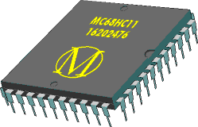
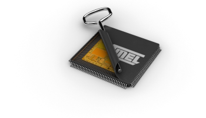
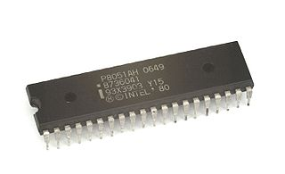

  

P8051 CPU Image By Konstantin Lanzet (with permission) - [CPU collection Konstantin Lanzet, CC BY-SA 3.0](https://commons.wikimedia.org/w/index.php?curid=4774266)

Description
-----------

GenDasm is a Generic Code-Seeking Disassembler engine.  It allows you to enter known starting vectors for a given code image for the micro.  It will disassemble the code and follow through branches to assist in the separation of code and data.

Its included Fuzzy Function Analyzer companion uses a DNA Sequence Alignment Algorithm to locate similar code in multiple binaries to facilitate reverse-engineering and/or code recovery.

The original purpose of the Fuzzy Function Analyzer was to assist in code recovery where the source code for the current binaries got lost, yet the source code for an old binary was retained.  The Fuzzy Function Analyzer allows you to match up known functions between the two binaries so you can concentrate on disassembling and reverse engineering the parts that are different and recover the code for the current binary that got lost.

The reason for fuzzy matching of the functions is because the absolute addresses cause differences in a normal diff even when the code is identical, making it otherwise difficult to discern which function is which.

This disassembler currently supports the M6811 micro, the MCS-51 (8051) Family of micros, and the AVR series of micros, and it can easily be expanded to include additional micros.

The origin of the tool started with the m6809dis and m6811dis code-seeking disassembler tools that I originally created when working with GM automotive engine controllers and with SuperFlow Dynamometers.

Target Assemblers
-----------------

The M6811DIS portion of this tool targets the 'as6811' assembler in the [ASxxxx Cross Assemblers](https://shop-pdp.net/index.php) by Alan Baldwin at Kent State University.  Note that this assembler requires a patch to remove the direct addressing mode optimization.  That is, opcodes using addresses in the $0000-$00FF range can use a shorter version of the opcode and the assembler is smart enough to figure that out and optimize your code.  However, not all original binary files are properly optimized, and in order to roundtrip to the same non-optimized binary, the optimizer in the assembler must be removed or disabled.  See the corresponding patch in the support folder.

The MCS-51 portion of this tool targets the 'as8051' assembler in the same [ASxxxx Cross Assemblers](https://shop-pdp.net/index.php) mentioned for the 6811.

The AVR portion of this tool targets both the [AVRA, Assembler for the Atmel AVR microcontroller family](https://github.com/Ro5bert/avra), assembler (the primary target assembler), and the 'asavr' assembler in the same [ASxxxx Cross Assemblers](https://shop-pdp.net/index.php) mentioned for the 6811.

If you disassemble code on this disassembler for one of these platforms, you will be able to use the corresponding assembler to reassemble it back into an identical binary image file.  Roundtrip testing is part of the test suite and independently verifies the output integrity of this disassembler.

History:
--------

The first version of m6809dis was written in 1992 in Borland Pascal on Windows and targeted the 6809, while working on analyzing the code from the SuperFlow SF-901 Dyno.  That version was reworked for the 6811 in April 1996 to create m6811dis, to analyze code from GM engine ECU modules, but still in Borland Pascal 7.0, with minor updates to v1.2 through June 1999.  In July 1999 through January 2000, m6811dis was rewritten to C++ using MSVC++ 5.0, but still on Windows (the original m6809dis got abandoned, but the 6809 processor is close enough to the 6811 that it wouldn't be too difficult to revive).

The Fuzzy Function Analyzer was first invented in May 2002, following the m6811dis port to C++, and was proven functional for several code-recovery projects from May 2002 through February 2003.  In June 2014, while salvaging old code remnants from the hard drive of a dead computer, I decided to finally open-source m6811dis and created [the first public version](https://github.com/dewhisna/m6811dis), after cleaning it up a bit, and making it work for Linux (now my operating system of choice), but without the Fuzzy-Function Analyzer (apart from legacy source code fragments) due to lack of time.

From the start, I had always intended m6811dis to get morphed into a more generic-disassembly platform, but never got around to it.  Then, in June 2021, I found that I needed a Disassembler and Fuzzy-Function Analyzer for the AVR series micros (particularly the ATmega328P and ATmega328PB).  So, I reworked the code again to modernize it to C++20 and bring the Fuzzy-Function Analyzer back from the dead.  I added AVR support, fixed numerous bugs, made things more generic in the support of big-endian vs. little-endian, Harvard vs Von Neumann architecture, RISC vs CISC, byte-opcodes vs word-opcodes, etc.  And thus [gendasm](https://github.com/dewhisna/gendasm) was born.

Then, in June 2024, I needed an 8051-based Disassembler and Fuzzy-Function Analyzer for reverse-engineering the firmware on the TI TAS1020B USB Audio Interface.  At one time, TI made the firmware source code freely available in a firmware development kit, but copies of that kit have mostly vanished from the internet and can't be readily located.  Apparently, once TI labels one of their devices as NRND, they hide and delete all copies of any development resources for those device, ignoring the fact that their customers might still have existing product in the field they need to support.  I guess the moral of that story is that design engineers should avoid using TI devices that require any sort of special development resources or tools.  In any case, this caused me to spend a day or two adding 8051 support to gendasm.

License
-------

GenDasm - Generic Code-Seeking Disassembler Engine

Copyright (c) 2021-2024 Donna Whisnant, a.k.a. Dewtronics.

Contact: <http://www.dewtronics.com/>

GNU General Public License Usage

This content may be used under the terms of the GNU General Public License
version 3.0 as published by the Free Software Foundation and appearing
in the file gpl-3.0.txt included in the packaging of this app. Please
review the following information to ensure the GNU General Public License
version 3.0 requirements will be met:

<http://www.gnu.org/copyleft/gpl.html>

Other Usage:

Alternatively, this repository may be used in accordance with the terms
and conditions contained in a signed written agreement between you and
Dewtronics, a.k.a. Donna Whisnant.

See '[LICENSE](./LICENSE.txt)' for the full content of the license.

